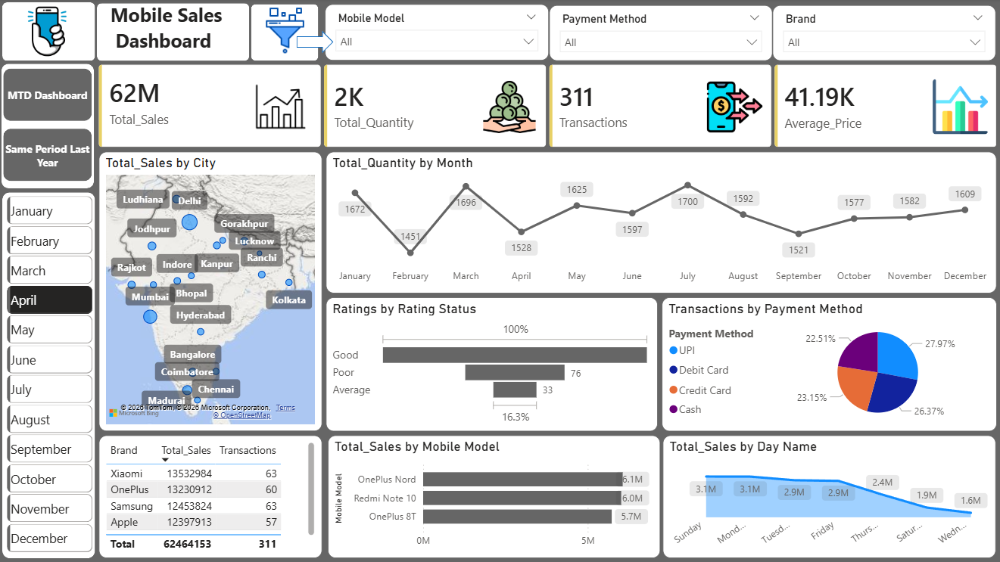
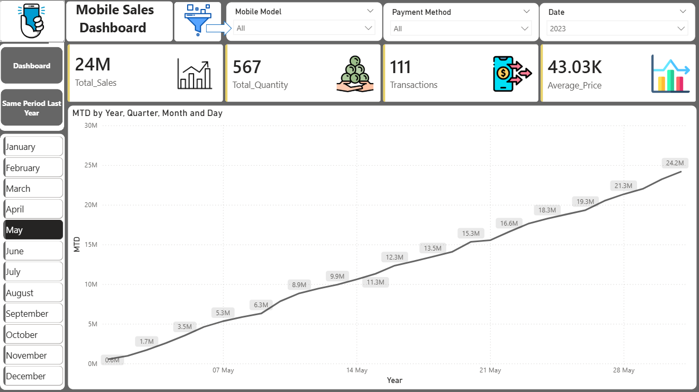
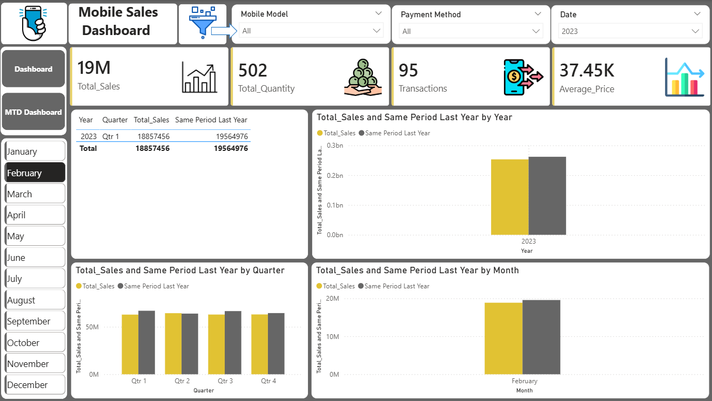

## 📊 Mobile Sales Dashboard(Power BI)

### 📌Project Overview
This project is an interactive Power BI dashboard built to analyze mobile sales data. It provides key insights into sales performance,transactions, and quantity using dynamic visuals and filters.

### 🛠️Tools & Tecnologies
- Power BI 

- Power Quary(Data Cleaning)

- DAX(Measures & Calculations)

### 📈 Key Insights
- KPI Cards(Total Sales, Quantity, Transactions)

- MTD, QTD, YTD Analysis

- Monthly Sales Trands

- City-wise Map Visualization 

- Interactive Slicers(Month,etc.)

### Dashboard Preview
Dashboard

MTD Report

Same Period Last Year

### 🎯Insights
- Tracks overall and monthly sales performance

- Helps identify top-performing cities

- Enables quick decision-making with interactive filters

### 👩🏻‍💻Author
**Nency Purohit**
- Aspiring Data Analyst 

- Skilled in Power BI , Excel, Data Analytics
